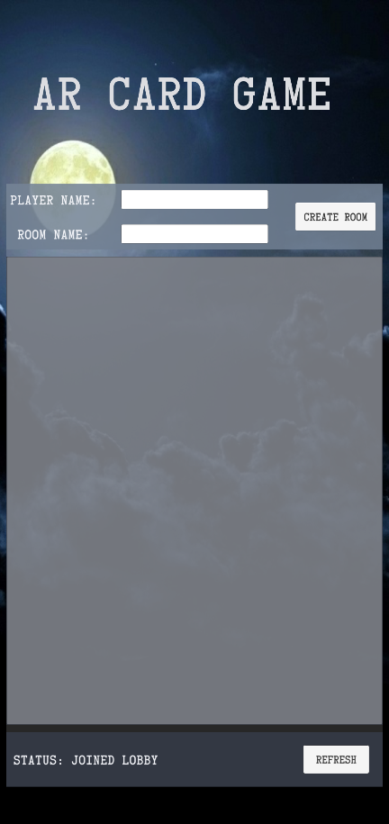
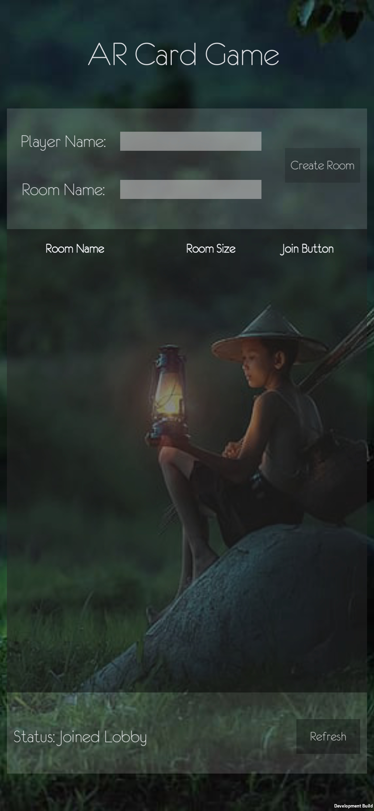
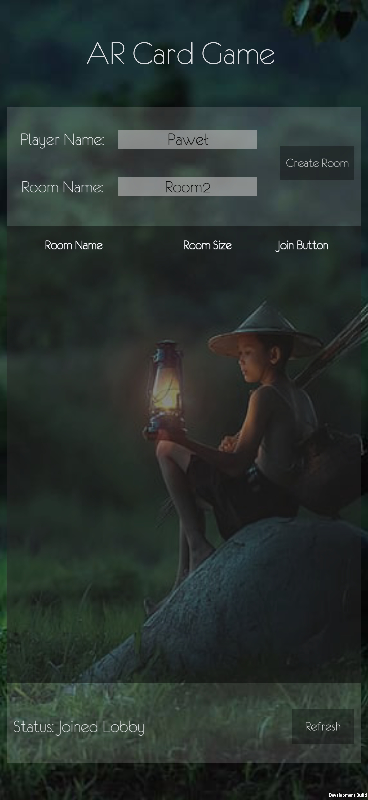
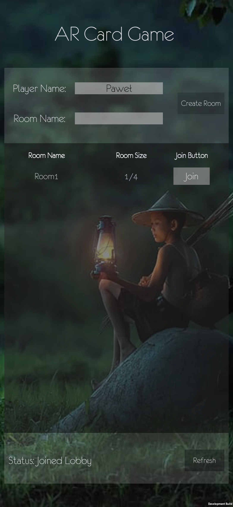
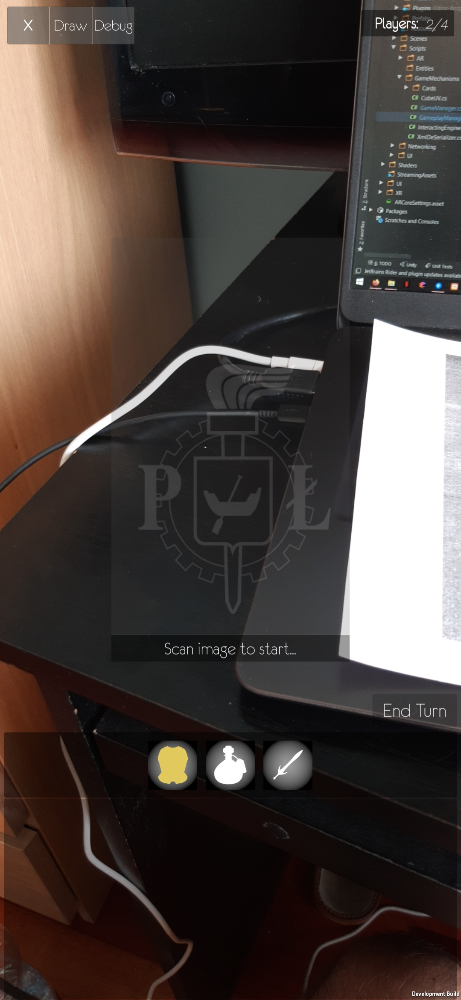
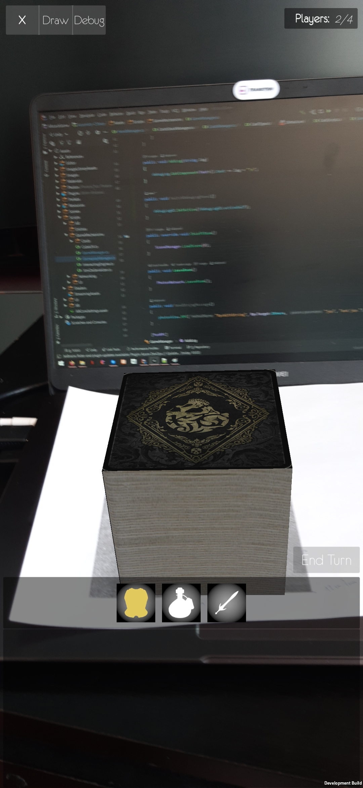
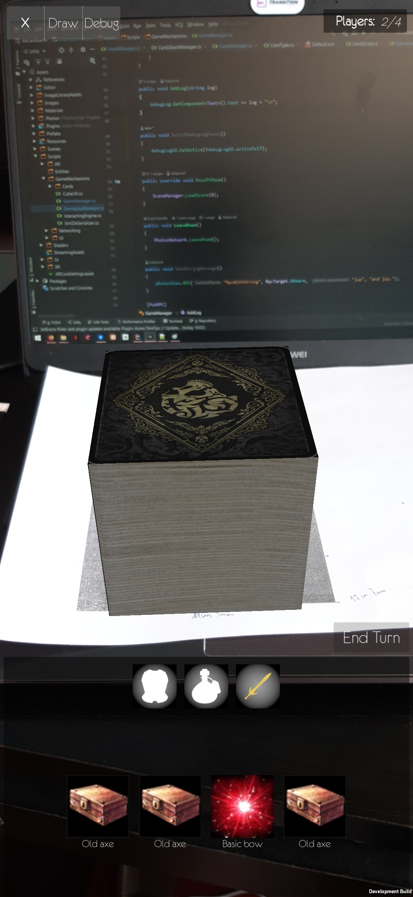
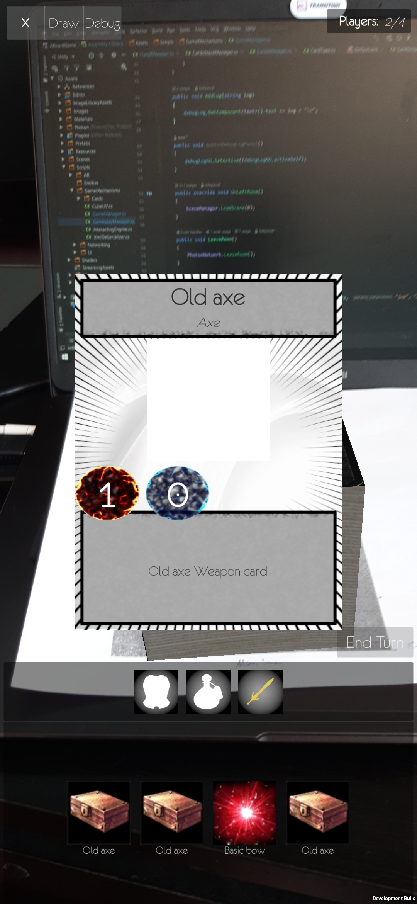
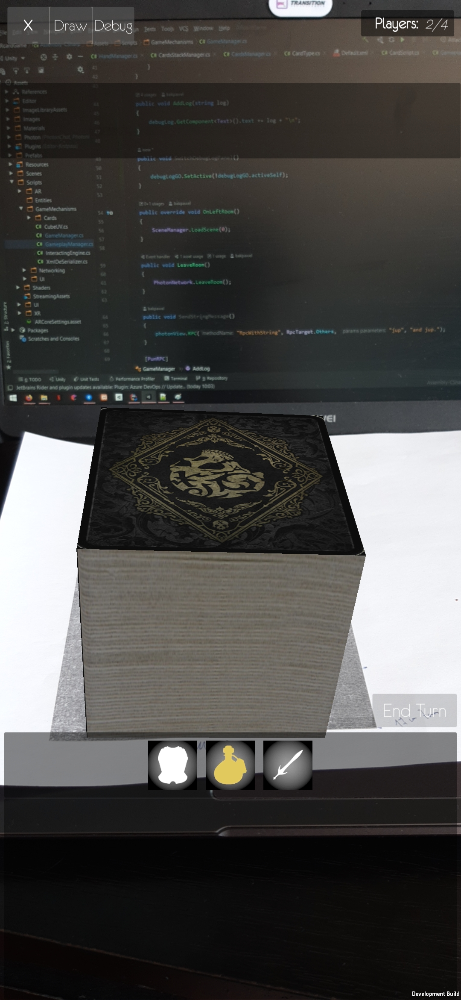

# *Praca inżynierska:*
*AR Foundation in Unity + Android/iOS + Photon Networking System*
*Gra planszowa/karciana multiplayer LAN/online.*

### *Trello ToDo List:*
- https://trello.com/invite/b/qa0HCiRn/9141d04ae80493bfdcfe7eb7a3bbdb09/ar-card-game

### *Flow:*
- [x] Gracz w lobby przeszukuje istniejące pokoje i dołącza do któregoś z nich, bądz tworzy własny 4-ro osobowy pokój
- [x] Gracz poproszony jest o zeskanowanie obrazka, który będzie punktem zerowym przy trackowaniu
- [x] Pozostali gracze mogą dołączyć do gry, wyszukując podany pokój w lobby
- [ ] Gracz widzi wizualizację kart wszystkich przeciwników. Jest w stanie położyć kartę na stole i jest to wizualizowane dla każdego gracza znajdującego się w tej grze.
- [ ] Gracz może rzucić kostką sześcienną.
- [ ] Zaimplementowane reguły gry.

### *News:*
<table>
  <tr>
    <th>Data</th>
    <th>Projekt</th>
    <th>Lobby</th>
    <th>Gra</th>
  </tr>
  <tr>
    <td>16.07.2020</td>
    <td>
      <ul>
        <li>Przejście z TCPClient i TCPListener na framework Photon</li>
        <li>Pierwsza scena, to scena z lobby, w którym możemy przeszukać istniejące pokoje i dołączyć do jednego z nich, bądź stworzyć własny</li>
        <li>Po dołączeniu do pokoju, przechodzimy do sceny z grą, gdzie od razu zostaniemy poproszeni o zeskanowanie obrazka (Na początek ikonka Politechniki Łódzkiej)</li>
      </ul>
    </td>
    <td>
      <ul>
        <li>Przebudowany system lobby z GUI do UI, który pozwala na sprawniejszą i wydajniejszą responsywność widoku oraz wydajniejsze pisanie kodu</li>
      </ul>
    </td>
    <td></td>
  </tr>
  <tr>
    <td>17.07.2020</td>
    <td></td>
    <td>
      <ul>
        <li>Przycisk Create Room dostępny, gdy uzupełniono polę Player Name oraz Room Name</li>
        <li>Przycisk Join Room dostępny, gdy uzupełniono polę Player Name</li>
      </ul>
    </td>
    <td>
      <ul>
        <li>Dodany przycisk wychodzenia z pokoju</li>
        <li>Dodany panel, w którym wyświetlana jest liczebność pokoju, w którym jest gracz</li>
        <li>Dodany obrazek zachęty do zeskanowania zdjęcia, który będzie punktem zerowym trackowania</li>
        <li>Obrazek zachęty znika, gdy zdjęcie zostało zeskanowane</li>
      </ul>
    </td>
  </tr>
  <tr>
    <td>18.07.2020</td>
    <td></td>
    <td>
      <ul>
        <li>Poprawiona zmiana przycisków Create Room, Join oraz Refresh na aktywne i dezaktywowanie</li>
      </ul>
    </td>
    <td>
      <ul>
        <li>Rozpoczęte prace nad modelem synchronizacji pozycji graczy w pokoju</li>
      </ul>
    </td>
  </tr>
  <tr>
    <td>19.07.2020</td>
    <td></td>
    <td></td>
    <td>
      <ul>
        <li>Pierwsze wysłanie wiadomości do wszystkich użytkowników w pokoju</li>
      </ul>
    </td>
  </tr>
  <tr>
    <td>20.07.2020</td>
    <td></td>
    <td></td>
    <td>
      <ul>
        <li>Zapoczątkowana struktura i model komunikacji pomiędzy użytkownikami pokoju a serwerem, który będzie menadżerem rozgrywki</li>
      </ul>
    </td>
  </tr>
  <tr>
    <td>28.07.2020</td>
    <td>
      <ul>
        <li>Rozpoczęte tworzenie systemu kart</li>
      </ul>
    </td>
    <td></td>
    <td>
      <ul>
        <li>Dodanie widoku paneli w grze, w której będą znajdować się karty gracza</li>
      </ul>
    </td>
  </tr>
  <tr>
    <td>01.08.2020</td>
    <td></td>
    <td></td>
    <td>
      <ul>
        <li>Działający widok z kartami gracza oraz przechodzeniem pomiędzy zakładkami z typami kart (ARMOUR, WEAPON, ITEMS)</li>
        <li>Wciśnięcie w kafelek z miniaturą karty powoduje wyświetlenie preview karty na środku ekranu- preview znika po puszczeniu kafelka</li>
      </ul>
    </td>
  </tr>
  <tr>
    <td>02.08.2020</td>
    <td></td>
    <td>
      <ul>
        <li>Poprawianie wyglądu lobby</li>
      </ul>
    </td>
    <td>
      <ul>
        <li>Poprawienie wyglądu gry</li>
        <li>Dodanie przycisku End Turn</li>
        <li>Dodanie przycisku oraz metody do pokazywania i ukrywania panelu z debug logiem</li>
      </ul>
    </td>
  </tr>
<<<<<<< HEAD
  <tr>
    <td>10.10.2020</td>
    <td>
      <ul>
        <li>Dodanie sktyptu Pythonowego, który generuje Hight Mapy. Będą wykorzystywane do tworzenia planszy 3d w grze z rzeczywistych obszarów na Ziemi</li>
      </ul>
	</td>
    <td></td>
	<td></td>
  </tr>
=======
>>>>>>> d7442c1a3e288cfbbd5ea6cddc24f614252550f4
</table>

### *Screenshots*

#### Lobby 0.1
<table style="padding:10px">
	<tr>
		<td>
			
		</td>
	</tr>
</table>

#### Lobby 0.2
<table style="padding:10px">
	<tr>
		<td>
			
		</td>
		<td>
			
		</td>
		<td>
			
		</td>
	</tr>
</table>

#### Game 0.2
<table style="padding:10px">
	<tr>
		<td>
			
		</td>
		<td>
			
		</td>
		<td>
			
		</td>
	</tr>
	<tr>
		<td>
			
		</td>
		<td>
			
		</td>
	</tr>
</table>

### *Bibliografia*
https://www.youtube.com/watch?v=4u5WCXNZ56I

### *Użyte technologie*
| Użyta technologia | URL |
| ------ | ------ |
| Photon | https://www.photonengine.com/ |
| Unity | https://unity.com/ |
| AR Foundation | https://unity.com/unity/features/arfoundation |
| Trello | https://trello.com/invite/b/qa0HCiRn/9141d04ae80493bfdcfe7eb7a3bbdb09/ar-card-game |
| Fonts | https://www.pixelsurplus.com/freebies |